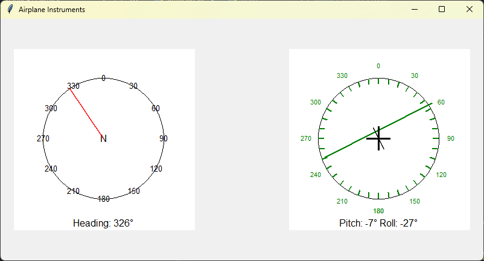

# flight-bit
micro:bit based rc flight companion, connects to your laptop and gives some data on heading, pitch and roll movements.
Unfortunately, due to the microbit's lack of a gyroscope, accurate measurements cannot be guaranteed in fast moving planes. It would be more prudent to use this as a demo,
a sort of quick fix. Slow moving aircraft that do not pull high gs would get the best usage. 

# dependencies
needs kaspersmicrobit for bluetooth connection

To setup micro:bit for use with this project, view the link [here](https://kaspersmicrobit.readthedocs.io/en/stable/makecode-bluetooth/download-a-hex-file-without-pairing/).
Download this hex, and simply run the python file

#images
An example UI

